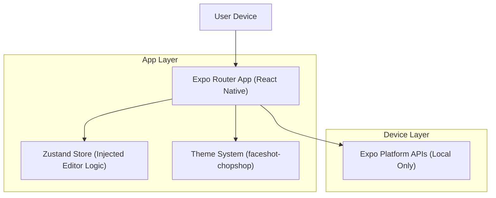

## 1.Architecture design

## 2.Technology Description
- Frontend: React Native + TypeScript + Expo + Expo Router
- State Management: Zustand (store contains an injectable logic adapter)
- Backend: None

## 3.Route definitions
| Route | Purpose |
|---|---|
| / | Home page: quick start and recent sessions |
| /editor | Editor page: 4-tier editor UI shell |
| /settings | Settings page: theme preview + developer toggles |

## 4.Folder structure (for the scaffold)
This structure keeps navigation in `app/` and the reusable editor shell in `src/`.

- `app/`
  - `_layout.tsx` (root layout: theme provider + logic injection boundary)
  - `index.tsx` (Home)
  - `editor.tsx` (Editor)
  - `settings.tsx` (Settings)
- `src/`
  - `features/`
    - `editor/`
      - `components/` (Tier 1–4 UI components)
      - `logic/` (logic interface + default mock implementation)
      - `models/` (types: tool ids, properties state)
  - `stores/`
    - `editorShell.store.ts` (Zustand store; holds injected logic + UI state)
  - `theme/`
    - `faceshotChopshop.tokens.ts` (colors, spacing, typography)
    - `faceshotChopshop.ThemeProvider.tsx`
  - `lib/` (small utilities: safe-area helpers, platform checks)
  - `types/` (shared app types)

## 5.State & injection design (Zustand)
Goal: the UI shell should not “know” how editing is implemented.

- Define an interface (example):
  - `EditorLogic` with methods like `selectTool(toolId)`, `setToolParam(key, value)`, `undo()`, `redo()`, `export()`.
- In Zustand:
  - Store `logic: EditorLogic` (default is a mock implementation).
  - Store UI state needed by the shell: `selectedToolId`, `toolParams`, `canUndo`, `canRedo`, `isBusy`.
- Injection mechanism:
  - Root `_layout.tsx` reads optional injected logic (e.g., from a config/module) and sets `logic` in the store once.

This supports later swapping in a real editor engine without rewriting the UI tiers.
